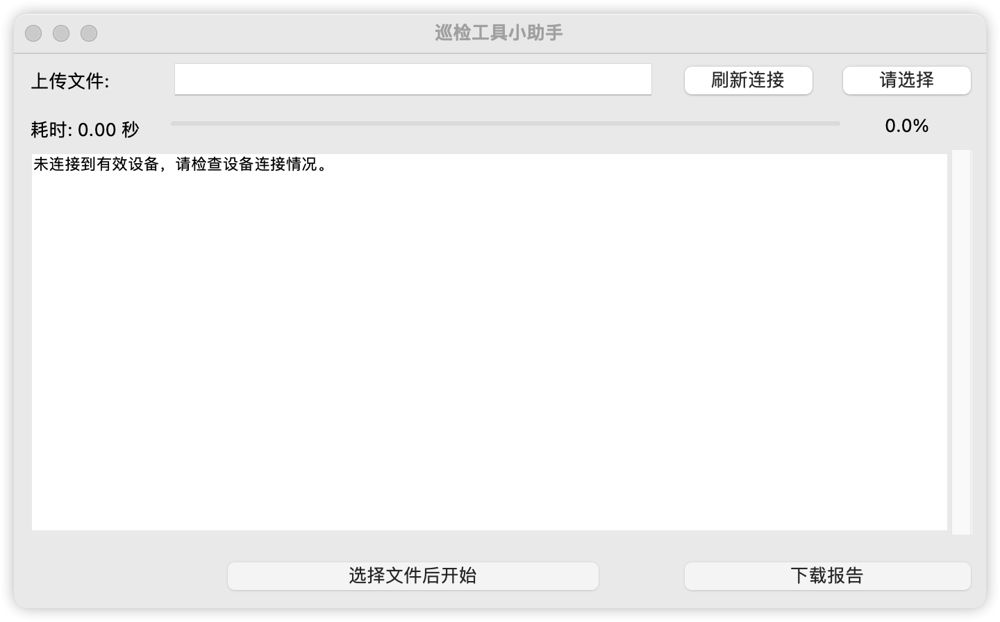

# AutoTestCodeTools
政务APP应用事项巡检可视化工具助手

依托于Airtest框架、POCOUI框架，实现某APP的自动化巡检工作。

本代码开源可用，支持Windows、macOS、linux三个系统编译使用

运行前需安装：pyinstaller

pip install pyinstaller

pyinstaller code2exe.spec --clean

（可选，配置upx进行包压缩）

=======
打包注意事项：

1.打包后需要将adb文件夹复制至生成的dist文件夹下；

2.需要将识别用到的图片复制到生成的dist文件夹下；

已实现功能：

启动APP

关闭APP

导入文件

导出文件

循环遍历

重复检查

报错 标红/标黄

后续开发……

检查一致性

提升工具包适配多APP

建立包组件库

…………
